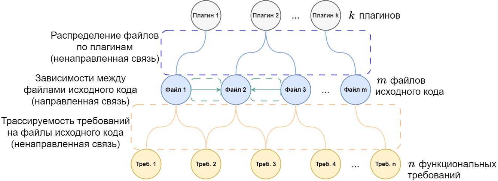

# Оптимизация состава комплектаций программного обеспечения

## Введение

В настоящее время решение оптимизационных задач - востребованное направление в сфере информационных технологий. Решение таких задач востребовано для...

Имея сведения об объеме стоимостных издержек каждого из реализованных требований можно оценить суммарную их величину, примению для всей версии ПО вцелом.

Однако существует возможность поставки одной и той же версии ПО в различных комплектациях. При этом величины стоимостных издержек реализованного требования в разных комплектациях могут отличаться и зависеть от реализованных смежных требований.

Пример систем, обеспечивающих такую возможность - плагинные системы. В них интеграционной единицей, несущей конечный объем функционала, является плагин. Так, комплектациями являются различные комплекты плагинов.

В таких системах выделяют следующие сущности предметной области:

1. функциональные требования;
2. файлы исходного кода; 
3. плагины.

Сущности образуют друг с другом следующие связи:

1. в файлах исходного кода на языке программирования описана реализация функциональных требований;
2. файлы исходного имеют зависимости друг на друга и для осуществляения поставки все зависимости должны быть разрешены;
3. плагины содержат файлы исходного кода и обеспечивают интеграцию с плагинной средой выполнения.

Сущности и связи между ними образуют граф. Используя его, определяются комплектации плагинов. Каждая комплектация реализует уникальный минимальный объем требований.

Оптимизация состава комплектаций заключается в решении задачи оптимальной декомпозиции файлов исходного кода между плагинами. Критерием оптимальности является суммарная стоимость издержек всех сформированных комплектаций.

## Описание модели

### Граф

На рисунке приведен пример графа, построенного по описанию сущностей предметной области.

Вершины в графе образуют:

1. $n$ функциональных требований;
2. $m$ файлов исходного кода;
3. $k$ плагинов.

$$n, m, k > 0 \quad n, m, k \in \mathbb{Z}$$

Ребра в графе образуются от:

1. трассируемости требований на файлы исходного кода;
2. наличия функциональных зависимостей между файлами исходного кода;
3. распределения файлов по плагинам.

### Полезные требования
Полезных требований может быть $l$ комбинаций. Каждой из таких комбинаций должна соответствовать комплектация, которая обеспечивает выполнение полезных требований. Соответственно должно быть $l$ комплектаций. 

Полезные требования образуют матрицу $R_{l \times n} = ||r_{i, j}||$. В ней номер строки соответствует номеру комплектации. Номер столбца соответствует индексу требования. Если в рамках $\tilde{l}$-й комплектации $\tilde{n}$-е требование полезно $r_{i, j} = 1$. Иначе $r_{i, j} = 0$.

$$r_{i, j} \in \{0, 1\} \quad \sum R_{i} \ge 1 \quad i = \overline{1, l} \quad j= \overline{1, n}$$

### Трассируемость требований на файлы исходного кода

Трассируемость требований на файлы исходного кода описывает связь требований и файлов. Связь характеризуется степенью ответственности файла для реализации требования.

Эти связи можно представить в виде матрицы $Q_{n \times m} = ||q_{i, j}||$. В ней номер строки - это индекс требования. Номер столбца - индекс файла исходного кода. Элементы $Q$ описывают долю ответственности файла для реализации требования. 

Каждый файл может быть необходим для реализации одного или нескольких требований, а каждое требование реализовано в одном или нескольких файлах. Допускается, что могут быть файлы, которые не задействованы в реализации хотябы одного требования, но каждое требование должно быть реализовано. За признак реализованности положена сумма соответствующих элементов матрицы, она должна быть равна $1$. Вследствие этого, элементы матрицы $Q$ удовлетворяют следующим условиям:

$$0 \le q_{i, j} \le 1 \quad \sum Q_{i} = 1 \quad i = \overline{1, n} \quad j = \overline{1, m}$$

### Полезные файлы исходного кода

Матрица $F_{l \times m} = ||f_{i, j}||$ описывает полезные к поставке файлы исходного кода в каждой из комплектаций. Номер строки соответствует номеру комплектации. Номер столбца соответствует индексу файла. Если в рамках $i$-й комплектации $j$-й файл полезен $f_{i, j} > 0$. Иначе $f_{i, j} = 0$.

Заметим, что если файл полезен, то нет обязательного условия на равенство значения элемента матрицы. Достаточно чтобы его значение было положительным числом.

$$f_{i, j} \ge 0 \quad i = \overline{1, l} \quad j = \overline{1, m}$$

Матрицы $F$ и $R$ связаны друг с другом через $Q$:

$$F = R \cdot Q$$

### Зависимости между файлами исходного кода

Файлы исходного кода имеют зависимости между друг другом. Зависимость одного файла от другого образует направленную связь, т.е. если первый файл зависит от второго, то второй необязательно зависит от первого.

Такие связи можно представить в виде матрицы бинарных отношений $D_{m \times m} = ||d_{i, j}||$. В ней номера строк и столбцов соответствуют индексам файлов исходного кода. Если $i$-й фал имеет зависимость на $j$-й, то $d_{i, j} = 1$. Иначе $d_{i, j} = 0$. Полагается, что файл не зависит сам от себя, поэтому значения элементов на главной диагонале равны $0$.

$$d_{i, j} \in \{0, 1\} \quad d_{\tilde{m}, \tilde{m}} = 0 \quad i = \overline{1, m} \quad j = \overline{1, m} \quad \tilde{m} = \overline{1, m}$$

### Разрешение зависимостей между файлами исходного кода

Для возможности включения в поставку файла исходного кода необходимо разрешить его зависимости. Разрешение зависимостей подразумевает включение в поставку тех файлов, от которых зависит изначальный. Для дополнительно включаемых файлов так же должны быть разрешены их зависимости.

Зависимости полезных файлов:

$$F' \gets F \cdot D$$

Их зависимости:

$$F'' \gets F' \cdot D = F \cdot D \cdot D = F \cdot D^{2}$$

Очевидно, что:

$$F^{(\sigma)} \gets F \cdot D^{\sigma}$$

Заметим, что максимальная глубина зависимостей не может превышать значение $m$, поэтому досточно разрешить зависимости до этого значения глубины.

Матрица $\hat{F}_{l \times m} = ||\hat{f}_{i, j}||$ описывает полезные файлы с учетом разрешения их зависимостей. Аналогично матрице $F$ в ней номер строки соответствует номеру комплектации, а номер столбца - индексу файла. Для вычисления значений матрицы необходимо просуммировать матрицу полезных файлов и каждую из матриц разрешения зависимостей.

$$\hat{F} \gets F + F' + F'' + ... + F^{(m)} = F + F \cdot D + F \cdot D^{2} + ... + F \cdot D^{m} = F \cdot (E + \sum^{m}_{i = 1}D^{i}) = F \cdot (D^{0} + \sum^{m}_{i = 1}D^{i}) = F \cdot \sum^{m}_{i = 0}D^{i}$$

Для значений матрицы $\hat{F}$ так же как и для значений матрицы $F$ характерно, что отсутствует ограничение на положительное значение.

$$\hat{f}_{i, j} \ge 0 \quad i = \overline{1, l} \quad j = \overline{1, m}$$

В результате вычислений элементы матрицы $\hat{F}$ могут принимать на столько большие значения, что дальнейшее с ними взаимодействие может быть затруднено. С целью нивелирования данного обстоятельства можно изменить значения матрицы $\hat{F}$ преобразовав их к бинарным отношениям применив следующую функцию:

$$f_{in}(x) = \begin{cases}
    0 & \quad \text{если } x = 0 \\
    1 & \quad \text{если } x > 0
\end{cases}$$

### Распределение файлов по плагинам
Файлы исходного кода распределены по плагинам. Для включения в поставку файла необходимо включить в комплектацию плагин, который этот файл содержит. Включенный в комплектацию плагин добавляет в поставку все файлы, которые содержит.

Распределение файлов по плагинам образуют матрицу бинарных отношений $X_{m \times k} = ||x_{i, j}||$. В ней номер строки соответствует индексу файла, номер столбца - индексу плагина. Если $i$-й файл относится к $j$-му плагину, то $x_{i, j} = 1$. Иначе $x_{i, j} = 0$.

Плагин может включать несколько файлов, а один файл не может относиться одновременно к разным плагинам. Каждый файл должен относиться к какому-либо плагину. Не каждый плагин должен включать хотя бы один файл. Именно поиск распределения файлов по плагинам предполагается в оптимизационной задаче. Вследствие этого элементы матрицы $X$ удовлетворяют следующим условиям:

$$x_{i, j} \in \{0, 1\} \quad \sum X_{i} = 1 \quad i = \overline{1, m} \quad j = \overline{1, k}$$

### Комплектации плагинов

Комплектация плагинов обеспечивает поставку полезного функционала и минимизирует поставку бесполезного. Каждая комплектация включает от $1$ до $k$ плагинов.

Комплектации плагинов для каждой комбинации полезных требований образуют матрицу бинарных отношений $P_{l \times k} = ||p_{i, j}||$. Номер строки соответсвует номеру комплектации. Номер столбца соответствует индексу плагина. Если $j$-й плагин должен быть включен в $i$-ю комплектацию $p_{i, j} = 1$. Иначе $p_{i, j} = 0$.

$$p_{i, j} \in \{0, 1\} \quad \sum P_{i} \ge 1 \quad i = \overline{1, l} \quad j = \overline{1, k}$$

Матрицы $P$ и $\hat{F}$ связаны друг с другом через $X$:

$$P \gets f_{in}(\hat{F} \cdot X)$$

### Алгоритм определения состава комплектаций

Алгоритм определения состава комплектаций:

1. ЛПР формирует комбинации полезных требоний $R_{l \times n}$.
2. Для каждой из них определяются полезные файлы исходного кода:

$$F_{l \times m} \gets R \cdot Q$$

3. Составляется матрица учитывающая полезные файлы и их разрешенные зависимости:

$$\hat{F}_{l \times m} \gets F \cdot \sum^{m}_{i = 0}D^{i}$$

4. Определяется состав плагинов каждой из комплектаций:

$$P_{l \times k} \gets f_{in}(\hat{F} \cdot X)$$

### Поставляемый код

Поставляемый код - это весь код, который относится к поставляемым в рамках комплектации плагинам. Его описывает матрица бинарных отношений $\dot{F}_{m \times l} = ||\dot{f}_{i, j}||$. В ней номер строки соответствует индексу файла. Номер строки соответствует номеру комплектации.

$$\dot{f}_{i, j} \in \{0, 1\} \quad i = \overline {1, m} \quad j = \overline{1, l}$$

Матрицы $\dot{F}$ и $P$ связаны друг с другом через $X$:

$$\dot{F} \gets X \cdot P^{T}$$

Примечательно, что ограничения значений матриц $X$ и $P$ обеспечивают бинарность отношений $\dot{F}$. Благодаря этому отсутсвует необходимость дополнительной бработки ее значений, например, с использованием функции $f_{in}$.

### Реализованные требования

Реализованным называется такое требование, для которого поставлен весь код, который задействован в его реализации. Состав реализованных требований влияет на стоимость комплектации.

Для определения того, поставляется ли весь код, ответственный за реализацию требования, применяется функция:

$$f_{im}(x) = \begin{cases}
    0 & \quad \text{если } x < 1 \\
    1 & \quad \text{если } x \ge 1
\end{cases}$$

Матрица бинарных отношений $\dot{R}_{l \times n} = ||\dot{r}_{i, j}||$ описывает состав реализованных требований в каждой из комплектаций. Номер строки соответствует номеру комплектации. Номер столбца соответствует индексу требования.

$$\dot{r}_{i, j} \in \{0, 1\} \quad i = \overline{1, l} \quad j = \overline{1, n}$$

Матрицы $\dot{R}$ и $\dot{F}$ связаны друг с другом через $Q$:

$$\dot{R} \gets f_{im}\big((Q \cdot \dot{F})^{T}\big) = f_{im}\Bigg(\bigg[Q \cdot X \cdot f_{in}\Big(\big[\hat{F} \cdot X\big]^{T}\Big)\bigg]^{T}\Bigg)$$

### Стоимостные характеристики

Стоимость реализованного требования не является постоянной величиной и может быть изменена в зависимости от реализации в комплектации смежных требований.

Величины изменения стоимости реализации требований описывает матрица $C_{n \times n} = ||c_{i, j}||$. В ней номера строк и столбцов соответствуют индексам требований. На ее главной диагонале значениями являются стоимости реализации требования без учета реализации смежных. Прочие элементы в строке указывают на сколько изменится стоимость реализации требования, если будет реализовано соответствующее смежное требование.

$$c_{i, j} \in \mathbb{R} \quad i = \overline{1, n} \quad j = \overline{1, n}$$

Заметим, что значением элемента матрицы $C$ может являться и отрицательное число. Это будет означать, что реализация одного требования уменьшает стоимость реализации другого. Это характерно, например, для дополняющего друг друга функционала.

### Стоимость комплектаций

Рассмотрим результирующую стоимость $i$-го требования в комплектации $\tilde{l}$:

<!-- $$\dot{r}_{1} \cdot c_{i, 1} + \dot{r}_{2} \cdot c_{i, 2} + ... + \dot{r}_{n} \cdot c_{i, n}$$ -->
$$с_{i, 1} \cdot \dot{r}_{\tilde{l}, 1} + с_{i, 2} \cdot \dot{r}_{\tilde{l}, 2} + ... + с_{i, n} \cdot \dot{r}_{\tilde{l}, n}$$

Данное выражение описывает стоимость требования как если бы оно входило в комплектацию. Однако даже если само оно не реализовано по этой формуле оно может иметь ненулевую стоимость. Чтобы невилировать это обстоятельство данное выражение необходимо домножить на признак реализованности $i$-го требования:

$$\dot{r}_{\tilde{l}, i} \cdot (с_{i, 1} \cdot \dot{r}_{\tilde{l}, 1} + с_{i, 2} \cdot \dot{r}_{\tilde{l}, 2} + ... + с_{i, n} \cdot \dot{r}_{\tilde{l}, n})$$

Стоимость одной комплектации - это суммарная стоимость всех реализованных в ней требований:

$$\sum^{n}_{i = 1} \big(\dot{r}_{\tilde{l}, i} \cdot (с_{i, 1} \cdot \dot{r}_{\tilde{l}, 1} + с_{i, 2} \cdot \dot{r}_{\tilde{l}, 2} + ... + с_{i, n} \cdot \dot{r}_{\tilde{l}, n})\big) = \dot{R}_{\tilde{l}} \cdot C \cdot \dot{R}^{T}_{\tilde{l}}$$

Суммарная стоимость всех требований во всех комплектациях:

$$\sum^{l}_{\tilde{l} = 1} (\dot{R}^{T}_{\tilde{l}} \cdot C \cdot \dot{R}_{\tilde{l}})$$

### Алгоритм определения стоимости комплектаций

Алгоритм определения :

1. Определяется состав комплектаций $P_{l \times k}$

2. Рассчитывается объем поставляемого кода в каждой из них:

$$\dot{F}_{m \times l} \gets X \cdot P^{T}$$

3. Выявляется состав реализованных требований в каждой из комплектаций:

$$\dot{R}_{l \times n} \gets f_{im}\big((Q \cdot \dot{F})^{T}\big)$$

4. Рассчитать стоимость комплектаций:

$$\sum^{l}_{\tilde{l} = 1} (\dot{R}_{\tilde{l}} \cdot C \cdot \dot{R}^{T}_{\tilde{l}})$$

<!-- $$\varPhi \quad \varphi \quad \Alpha \quad \alpha \quad \Beta \quad \beta \quad \Gamma \quad \gamma$$ -->

<!-- Про линеаризацию и построение задачи линейного программирования -->
### Задача линейного программирования

Оптимизационная задача может быть решена как задача линейного программирования. С этой целью необходимо построить математическую модель: описать целевую функции и ограничения на значения задействованных переменных.

Для описания ограничений в общем виде используются следующие переменные:

$$\tilde{l} = \overline{1, l} \quad \tilde{n} = \overline{1, n} \quad \tilde{m} = \overline{1, m} \quad \tilde{k} = \overline{1, k}$$

Например, согласно условиям на значения элементов матрицы $X$ действуют следующие ограничения:

$$
\begin{cases}
    x_{1, 1} + x_{1, 2} + \cdots + x_{1, k} = 1 \\
    x_{2, 1} + x_{2, 2} + \cdots + x_{2, k} = 1 \\
    \cdots \\
    x_{m, 1} + x_{m, 2} + \cdots + x_{m, k} = 1
\end{cases}
$$

Используя введенные переменные вышеуказанные ограничения будут записаны так:

$$\sum^{k}_{\tilde{k} = 1} x_{\tilde{m}, \tilde{k}} = 1$$

Формирование целевой функции осуществляется при следовании этапам вышеописанных алгоритмов.

Следуя алгоритму определения состава комплектаций первые три шага не подразумевают наличия переменных, а значит для целевой функции важны значения матрицы $\hat{F}$:

$$\hat{F} \gets R \cdot Q \ \sum^{m}_{s = 0} D^{s} =
\begin{pmatrix}
    \hat{f}_{1, 1} & \hat{f}_{1, 2} & \cdots & \hat{f}_{1, m} \\
    \hat{f}_{2, 1} & \hat{f}_{2, 2} & \cdots & \hat{f}_{2, m} \\
    \vdots         & \vdots         & \ddots & \vdots         \\
    \hat{f}_{n, 1} & \hat{f}_{n, 2} & \cdots & \hat{f}_{n, m}
\end{pmatrix}
$$

Далее $\hat{F}$ необходимо умножить на $X$:

$$
P \gets \hat{F} \cdot X = 
\begin{pmatrix}
    \hat{f}_{1, 1} \cdot x_{1, 1} + \hat{f}_{1, 2} \cdot x_{2, 1} + \cdots + \hat{f}_{1, m} \cdot x_{m, 1} &
    \hat{f}_{1, 1} \cdot x_{1, 2} + \hat{f}_{1, 2} \cdot x_{2, 2} + \cdots + \hat{f}_{1, m} \cdot x_{m, 2} &
    \cdots &
    \hat{f}_{1, 1} \cdot x_{1, k} + \hat{f}_{1, 2} \cdot x_{2, k} + \cdots + \hat{f}_{1, m} \cdot x_{m, k} \\

    \hat{f}_{2, 1} \cdot x_{1, 1} + \hat{f}_{2, 2} \cdot x_{2, 1} + \cdots + \hat{f}_{2, m} \cdot x_{m, 1} &
    \hat{f}_{2, 1} \cdot x_{1, 2} + \hat{f}_{2, 2} \cdot x_{2, 2} + \cdots + \hat{f}_{2, m} \cdot x_{m, 2} &
    \cdots &
    \hat{f}_{2, 1} \cdot x_{1, k} + \hat{f}_{2, 2} \cdot x_{2, k} + \cdots + \hat{f}_{2, m} \cdot x_{m, k} \\

    \vdots   & \vdots   & \ddots & \vdots   \\

    \hat{f}_{n, 1} \cdot x_{1, 1} + \hat{f}_{n, 2} \cdot x_{2, 1} + \cdots + \hat{f}_{n, m} \cdot x_{m, 1} &
    \hat{f}_{n, 1} \cdot x_{1, 2} + \hat{f}_{n, 2} \cdot x_{2, 2} + \cdots + \hat{f}_{n, m} \cdot x_{m, 2} &
    \cdots &
    \hat{f}_{n, 1} \cdot x_{1, k} + \hat{f}_{n, 2} \cdot x_{2, k} + \cdots + \hat{f}_{n, m} \cdot x_{m, k} \\
\end{pmatrix}
$$

Для рассчета $P$ к каждому элементу матрицы необходимо применить $f_{in}(x)$, для которой так же необходимо выполнить линеаризацию. Для ее линеаризации используется метод big M. Следуя ему, вводится постоянная величина $M$ - условно большое число. Так же модель дополняется бинарной переменной $\alpha \in \{0, 1\}$, на которую действуют следующие ограничения:

$$
f_{in}(x) = 
\begin{cases}
    \alpha < x + 1 \\
    x \le M \cdot \alpha
\end{cases}
$$

Доказательство корректности ограничений методом разбора случаев приведено в таблице:

| $x$   | $\alpha$   | $f_{1}=(\alpha < x + 1)$ | $f_{2} = (x \le M \cdot \alpha)$ | $f_{1} \wedge f_{2}$
|     :-:      |  :-:  | :-:   |  :-:  |  :-:  |
|      0       |   0   | true  | true  | true  |
|      0       |   1   | false | true  | false |
|    (0;1)     |   0   | true  | false | false |
|    (0;1)     |   1   | true  | true  | true  |
|      1       |   0   | true  | false | false |
|      1       |   1   | true  | true  | true  |
| (1;$\infty$) |   0   | false | false | false |
| (1;$\infty$) |   1   | true  | true  | true  |

Для будущей программной реализации строгое неравенство должно быть заменено нестрогим. С этой целью вводится постоянная величина $1 / M$ - условно малое число. Тогда, например, выражение вида $a < b$ будет записано как $a + 1 / M \le b$.

Выражение $f_{in}(\hat{f}_{\tilde{l}, 1} \cdot x_{1, \tilde{k}} + \hat{f}_{\tilde{l}, 2} \cdot x_{2, \tilde{k}} + \cdots + \hat{f}_{\tilde{l}, m} \cdot x_{m, \tilde{k}})$ заменяется на $\alpha_{\tilde{l}, \tilde{k}}$, а модель дополняется ограничениями:
$$
\begin{cases}
    \alpha_{\tilde{l}, \tilde{k}} + 1 / M - (\hat{f}_{\tilde{l}, 1} \cdot x_{1, \tilde{k}} + \hat{f}_{\tilde{l}, 2} \cdot x_{2, \tilde{k}} + \cdots + \hat{f}_{\tilde{l}, m} \cdot x_{m, \tilde{k}}) \le 0 \\
    \hat{f}_{\tilde{l}, 1} \cdot x_{1, \tilde{k}} + \hat{f}_{\tilde{l}, 2} \cdot x_{2, \tilde{k}} + \cdots + \hat{f}_{\tilde{l}, m} \cdot x_{m, \tilde{k}} \cdot x_{m, 1} - M \cdot \alpha_{\tilde{l}, \tilde{k}} \le 0
\end{cases}
$$

Эти преобразования дополнили модель $l \cdot k$ переменными и $2 \cdot l \cdot k$ ограничениями.

Состав плагинов каждой из комплектаций:
$$P = 
\begin{pmatrix}
    \alpha_{1, 1} & \alpha_{1, 2} & \cdots & \alpha_{1, k} \\
    \alpha_{2, 1} & \alpha_{2, 2} & \cdots & \alpha_{2, k} \\
    \vdots        & \vdots        & \ddots & \vdots         \\
    \alpha_{l, 1} & \alpha_{l, 2} & \cdots & \alpha_{l, k}
\end{pmatrix}
$$

Cостав поставляемого кода:

$$\dot{F} \gets X \cdot P^{T} =
 
\begin{pmatrix}
    x_{1, 1} \cdot \alpha_{1, 1} + x_{1, 2} \cdot \alpha_{1, 2} + \cdots + x_{1, k} \cdot \alpha_{1, k} &
    x_{1, 1} \cdot \alpha_{2, 1} + x_{1, 2} \cdot \alpha_{2, 2} + \cdots + x_{1, k} \cdot \alpha_{2, k} &
    \cdots &
    x_{1, 1} \cdot \alpha_{l, 1} + x_{1, 2} \cdot \alpha_{l, 2} + \cdots + x_{1, k} \cdot \alpha_{l, k} \\

    x_{2, 1} \cdot \alpha_{1, 1} + x_{2, 2} \cdot \alpha_{1, 2} + \cdots + x_{2, k} \cdot \alpha_{1, k} &
    x_{2, 1} \cdot \alpha_{2, 1} + x_{2, 2} \cdot \alpha_{2, 2} + \cdots + x_{2, k} \cdot \alpha_{2, k} &
    \cdots &
    x_{2, 1} \cdot \alpha_{l, 1} + x_{2, 2} \cdot \alpha_{l, 2} + \cdots + x_{2, k} \cdot \alpha_{l, k} \\

    \vdots & \vdots & \ddots & \vdots \\

    x_{m, 1} \cdot \alpha_{1, 1} + x_{m, 2} \cdot \alpha_{1, 2} + \cdots + x_{m, k} \cdot \alpha_{1, k} &
    x_{m, 1} \cdot \alpha_{2, 1} + x_{m, 2} \cdot \alpha_{2, 2} + \cdots + x_{m, k} \cdot \alpha_{2, k} &
    \cdots &
    x_{m, 1} \cdot \alpha_{l, 1} + x_{m, 2} \cdot \alpha_{l, 2} + \cdots + x_{m, k} \cdot \alpha_{l, k} \\
\end{pmatrix}
$$

Выражения в матрице $\dot{F}$ нелинейны. Однако в силу того, что переменные $x$ и $\alpha$ бинарные, каждое из этих выражений может быть приведено к линейному виду благодаря вводу дополнительной бинарной переменной $\beta \in \{0, 1\}$ и дополнению модели следующими ограничениями:

$$
\begin{cases}
    x + \alpha \le \beta + 1 \\
    \beta \le x \\
    \beta \le \alpha
\end{cases}
$$

Доказательство корректности ограничений методом разбора случаев приведенов таблице:

| $x$ | $\alpha$ | $\beta$ | $f_{1}=(x + \alpha \le \beta + 1)$ | $f_{2} = (\beta \le x)$ | $f_{3} = (\beta \le \alpha)$ | $f_{1} \wedge f_{2} \wedge f_{3}$
| :-: | :-: | :-: | :-:   | :-:   |  :-:  |  :-:  |
|  0  |  0  |  0  | true  | true  | true  | true  |
|  0  |  0  |  1  | true  | false | false | false |
|  0  |  1  |  0  | true  | true  | true  | true  |
|  0  |  1  |  1  | true  | false | true  | false |
|  1  |  0  |  0  | true  | true  | true  | true  |
|  1  |  0  |  1  | true  | true  | false | false |
|  1  |  1  |  0  | false | true  | true  | false |
|  1  |  1  |  1  | true  | true  | true  | true  |

Эти преобразования дополняют модель $l \cdot m \cdot k$ переменными и $3 \cdot l \cdot m \cdot k$ ограничениями:

$$
\begin{cases}
    x_{\tilde{m}, \tilde{l}} + \alpha_{\tilde{l}, \tilde{k}} - (\beta_{k \cdot (\tilde{m} - 1) + \tilde{k}, \tilde{l}} + 1) \le 0 \\
    \beta_{k \cdot (\tilde{m} - 1) + \tilde{k}, \tilde{l}} - x_{\tilde{m}, \tilde{k}} \le 0 \\
    \beta_{k \cdot (\tilde{m} - 1) + \tilde{k}, \tilde{l}} - \alpha_{\tilde{l}, \tilde{k}} \le 0 \\
\end{cases}
$$

Тогда состав поставляемого кода с учетом введенных переменных:

$$\dot{F} =
\begin{pmatrix}
    \beta_{1, 1} + \beta_{2, 1} + \cdots + \beta_{k, 1} & 
    \beta_{1, 2} + \beta_{2, 2} + \cdots + \beta_{k, 2} &
    \cdots &
    \beta_{1, l} + \beta_{2, l} + \cdots + \beta_{k, l} \\

    \beta_{k + 1, 1} + \beta_{k + 2, 1} + \cdots + \beta_{2 \cdot k, 1} &
    \beta_{k + 1, 2} + \beta_{k + 2, 2} + \cdots + \beta_{2 \cdot k, 2} &
    \cdots &
    \beta_{k + 1, l} + \beta_{k + 2, l} + \cdots + \beta_{2 \cdot k, l} \\

    \vdots & \vdots & \ddots & \vdots \\

    \beta_{k \cdot (m -1) + 1, 1} + \beta_{k \cdot (m -1) + 2, 1} + \cdots + \beta_{k \cdot m, 1} &
    \beta_{k \cdot (m -1) + 1, 2} + \beta_{k \cdot (m -1) + 2, 2} + \cdots + \beta_{k \cdot m, 2} &
    \cdots &
    \beta_{k \cdot (m -1) + 1, l} + \beta_{k \cdot (m -1) + 2, l} + \cdots + \beta_{k \cdot m, l} \\
\end{pmatrix}
$$

Определение состава реализованных требований в комплектациях:

$$\dot{R} \gets f_{im}\big((Q \cdot \dot{F})^{T}\big)$$

$$(Q \cdot \dot{F})^{T} = 
\begin{pmatrix}
    q_{1, 1} \cdot (\beta_{1, 1} + \beta_{2, 1} + \cdots + \beta_{k, 1}) + q_{1, 2} \cdot (\beta_{k + 1, 1} + \beta_{k + 2, 1} + \cdots + \beta_{2 \cdot k, 1}) + \cdots + q_{1, m} \cdot (\beta_{k \cdot (m -1) + 1, 1} + \beta_{k \cdot (m -1) + 2, 1} + \cdots + \beta_{k \cdot m, 1}) &

    q_{2, 1} \cdot (\beta_{1, 1} + \beta_{2, 1} + \cdots + \beta_{k, 1}) + q_{2, 2} \cdot (\beta_{k + 1, 1} + \beta_{k + 2, 1} + \cdots + \beta_{2 \cdot k, 1}) + \cdots + q_{2, m} \cdot (\beta_{k \cdot (m -1) + 1, 1} + \beta_{k \cdot (m -1) + 2, 1} + \cdots + \beta_{k \cdot m, 1}) &

    \cdots &

    q_{n, 1} \cdot (\beta_{1, 1} + \beta_{2, 1} + \cdots + \beta_{k, 1}) + q_{n, 2} \cdot (\beta_{k + 1, 1} + \beta_{k + 2, 1} + \cdots + \beta_{2 \cdot k, 1}) + \cdots + q_{n, m} \cdot (\beta_{k \cdot (m -1) + 1, 1} + \beta_{k \cdot (m -1) + 2, 1} + \cdots + \beta_{k \cdot m, 1}) \\

    q_{1, 1} \cdot (\beta_{1, 2} + \beta_{2, 2} + \cdots + \beta_{k, 2}) + q_{1, 2} \cdot (\beta_{k + 1, 2} + \beta_{k + 2, 2} + \cdots + \beta_{2 \cdot k, 2}) + \cdots + q_{1, m} \cdot (\beta_{k \cdot (m -1) + 1, 2} + \beta_{k \cdot (m -1) + 2, 2} + \cdots + \beta_{k \cdot m, 2}) &

    q_{2, 1} \cdot (\beta_{1, 2} + \beta_{2, 2} + \cdots + \beta_{k, 2}) + q_{2, 2} \cdot (\beta_{k + 1, 2} + \beta_{k + 2, 2} + \cdots + \beta_{2 \cdot k, 2}) + \cdots + q_{2, m} \cdot (\beta_{k \cdot (m -1) + 1, 2} + \beta_{k \cdot (m -1) + 2, 2} + \cdots + \beta_{k \cdot m, 2}) &

    \cdots &

    q_{n, 1} \cdot (\beta_{1, 2} + \beta_{2, 2} + \cdots + \beta_{k, 2}) + q_{n, 2} \cdot (\beta_{k + 1, 2} + \beta_{k + 2, 2} + \cdots + \beta_{2 \cdot k, 2}) + \cdots + q_{n, m} \cdot (\beta_{k \cdot (m -1) + 1, 2} + \beta_{k \cdot (m -1) + 2, 2} + \cdots + \beta_{k \cdot m, 2}) \\

    \vdots & \vdots & \ddots & \vdots \\

    q_{1, 1} \cdot (\beta_{1, l} + \beta_{2, l} + \cdots + \beta_{k, l}) + q_{1, 2} \cdot (\beta_{k + 1, l} + \beta_{k + 2, l} + \cdots + \beta_{2 \cdot k, l}) + \cdots + q_{1, m} \cdot (\beta_{k \cdot (m -1) + 1, l} + \beta_{k \cdot (m -1) + 2, l} + \cdots + \beta_{k \cdot m, l}) &

    q_{2, 1} \cdot (\beta_{1, l} + \beta_{2, l} + \cdots + \beta_{k, l}) + q_{2, 2} \cdot (\beta_{k + 1, l} + \beta_{k + 2, l} + \cdots + \beta_{2 \cdot k, l}) + \cdots + q_{2, m} \cdot (\beta_{k \cdot (m -1) + 1, l} + \beta_{k \cdot (m -1) + 2, l} + \cdots + \beta_{k \cdot m, l}) &

    \cdots &

    q_{n, 1} \cdot (\beta_{1, l} + \beta_{2, l} + \cdots + \beta_{k, l}) + q_{n, 2} \cdot (\beta_{k + 1, l} + \beta_{k + 2, l} + \cdots + \beta_{2 \cdot k, l}) + \cdots + q_{n, m} \cdot (\beta_{k \cdot (m -1) + 1, l} + \beta_{k \cdot (m -1) + 2, l} + \cdots + \beta_{k \cdot m, l}) \\

\end{pmatrix}
$$

Для функции $f_{im}$ необходимо выполнить линеаризацию. По аналогии с линеаризацией $f_{in}$ используется метод big M. Модель дополняется бинарной переменной $\gamma \in \{0, 1\}$, на которую действуют следующие ограничения:

$$f_{im}(x) =
\begin{cases}
    x \ge \gamma \\
    x < M \cdot \gamma + 1
\end{cases}
$$

Доказательство корректности ограничений методом разбора случаев приведено в таблице:

| $x$   | $\gamma$   | $f_{1}=(x \ge \gamma)$ | $f_{2} = (x < M \cdot \gamma + 1)$ | $f_{1} \wedge f_{2}$
|     :-:      |  :-:  | :-:   |  :-:  |  :-:  |
|      0       |   0   | true  | true  | true  |
|      0       |   1   | false | true  | false |
|    (0;1)     |   0   | true  | true  | true  |
|    (0;1)     |   1   | false | true  | false |
|      1       |   0   | true  | false | false |
|      1       |   1   | true  | true  | true  |
| (1;$\infty$) |   0   | true  | false | false |
| (1;$\infty$) |   1   | true  | true  | true  |

Эти преобразования дополняют модель $l \cdot n$ переменными и $2 \cdot l \cdot n$ ограничениями:

$$
\begin{cases}
    \gamma_{\tilde{l}, \tilde{n}} - \big(q_{\tilde{n}, 1} \cdot (\beta_{1, \tilde{l}} + \beta_{2, \tilde{l}} + \cdots + \beta_{k, \tilde{l}}) + q_{\tilde{n}, 2} \cdot (\beta_{k + 1, \tilde{l}} + \beta_{k + 2, \tilde{l}} + \beta_{2 \cdot k, \tilde{l}}) + \cdots + q_{\tilde{n}, m} \cdot (\beta_{k \cdot (m - 1) + 1, \tilde{l}} + \beta_{k \cdot (m - 1) + 2, \tilde{l}} + \cdots + \beta_{k \cdot m, \tilde{l}} ) \big) \le 0 \\
    q_{\tilde{n}, 1} \cdot (\beta_{1, \tilde{l}} + \beta_{2, \tilde{l}} + \cdots + \beta_{k, \tilde{l}}) + q_{\tilde{n}, 2} \cdot (\beta_{k + 1, \tilde{l}} + \beta_{k + 2, \tilde{l}} + \beta_{2 \cdot k, \tilde{l}}) + \cdots + q_{\tilde{n}, m} \cdot (\beta_{k \cdot (m - 1) + 1, \tilde{l}} + \beta_{k \cdot (m - 1) + 2, \tilde{l}} + \cdots + \beta_{k \cdot m, \tilde{l}}) + 1 / M - (M \cdot \gamma_{\tilde{l}, \tilde{n}} + 1) \le 0
\end{cases}
$$

Тогда состав реализованных требований с учетом введенных переменных:

$$
\dot{R} = 
\begin{pmatrix}
    \gamma_{1, 1} & \gamma_{1, 2} & \cdots & \gamma_{1, n} \\
    \gamma_{2, 1} & \gamma_{2, 2} & \cdots & \gamma_{2, n} \\
    \vdots        & \vdots        & \ddots & \vdots \\
    \gamma_{l, 1} & \gamma_{l, 2} & \cdots & \gamma_{l, n}
\end{pmatrix}
$$

Определение суммарной стоимости реализованных требований в комплектациях:

$$
\sum^{l}_{\tilde{l} = 1} (\dot{R}_{\tilde{l}} \cdot C \cdot \dot{R}^{T}_{\tilde{l}}) = 
    \sum^{l}_{\tilde{l} = 1} \big(
        \gamma_{\tilde{l}, \tilde{n}} \cdot (\gamma_{\tilde{l}, 1} \cdot c_{1, 1} + \gamma_{\tilde{l}, 2} \cdot c_{1, 2} + \cdots + \gamma_{\tilde{l}, n} \cdot c_{1, n})
    \big)
$$

Выражение нелинейно. Однако в силу того, что переменные $\gamma$ бинарные, это выражение может быть приведено к линейному виду благодаря вводу дополнительной бинарной переменной $\varphi \in \{0, 1\}$ и дополнению модели следующими ограничениями от умножения бинарных переменных:

$$
\begin{cases}
    \gamma_{\tilde{l}, 1} \cdot c_{1, 1} + \gamma_{\tilde{l}, 2} \cdot c_{1, 2} + \cdots + \gamma_{\tilde{l}, n} \cdot c_{1, n} - (\varphi_{\tilde{l}, \tilde{n}} + 1) \le 0 \\
    \varphi_{\tilde{l}, \tilde{n}} - \gamma_{\tilde{l}, \tilde{n}} \le 0 \\
    \varphi_{\tilde{l}, \tilde{n}} - (\gamma_{\tilde{l}, 1} \cdot c_{1, 1} + \gamma_{\tilde{l}, 2} \cdot c_{1, 2} + \cdots + \gamma_{\tilde{l}, n} \cdot c_{1, n}) \le 0
\end{cases}
$$

Эти преобразования дополняют модель $l \cdot n$ переменными и $3 \cdot l \cdot n$ ограничениями.

Суммарная стоимость реализованных требований:

$$
\sum^{l}_{\tilde{l} = 1}\sum^{n}_{\tilde{n} = 1}\varphi_{\tilde{l}, \tilde{n}}
$$

Таким образом сформулирована задача линейного программирования:

|     | $\displaystyle \sum^{l}_{\tilde{l} = 1}\sum^{n}_{\tilde{n} = 1}\varphi_{\tilde{l}, \tilde{n}}$ | 
| :-: |  :-  | 
|s.t.  | $\gamma_{\tilde{l}, 1} \cdot c_{1, 1} + \gamma_{\tilde{l}, 2} \cdot c_{1, 2} + \cdots + \gamma_{\tilde{l}, n} \cdot c_{1, n} - (\varphi_{\tilde{l}, \tilde{n}} + 1) \le 0$ | 
|     | $\varphi_{\tilde{l}, \tilde{n}} - \gamma_{\tilde{l}, \tilde{n}} \le 0$ | 
|     | $\varphi_{\tilde{l}, \tilde{n}} - (\gamma_{\tilde{l}, 1} \cdot c_{1, 1} + \gamma_{\tilde{l}, 2} \cdot c_{1, 2} + \cdots + \gamma_{\tilde{l}, n} \cdot c_{1, n}) \le 0$ | 
|     | $\gamma_{\tilde{l}, \tilde{n}} - \big(q_{\tilde{n}, 1} \cdot (\beta_{1, \tilde{l}} + \beta_{2, \tilde{l}} + \cdots + \beta_{k, \tilde{l}}) + q_{\tilde{n}, 2} \cdot (\beta_{k + 1, \tilde{l}} + \beta_{k + 2, \tilde{l}} + \beta_{2 \cdot k, \tilde{l}}) + \cdots + q_{\tilde{n}, m} \cdot (\beta_{k \cdot (m - 1) + 1, \tilde{l}} + \beta_{k \cdot (m - 1) + 2, \tilde{l}} + \cdots + \beta_{k \cdot m, \tilde{l}} ) \big) \le 0$ | 
|     | $q_{\tilde{n}, 1} \cdot (\beta_{1, \tilde{l}} + \beta_{2, \tilde{l}} + \cdots + \beta_{k, \tilde{l}}) + q_{\tilde{n}, 2} \cdot (\beta_{k + 1, \tilde{l}} + \beta_{k + 2, \tilde{l}} + \beta_{2 \cdot k, \tilde{l}}) + \cdots + q_{\tilde{n}, m} \cdot (\beta_{k \cdot (m - 1) + 1, \tilde{l}} + \beta_{k \cdot (m - 1) + 2, \tilde{l}} + \cdots + \beta_{k \cdot m, \tilde{l}}) + 1 / M - (M \cdot \gamma_{\tilde{l}, \tilde{n}} + 1) \le 0$ | 
|     |  $x_{\tilde{m}, \tilde{l}} + \alpha_{\tilde{l}, \tilde{k}} - (\beta_{k \cdot (\tilde{m} - 1) + \tilde{k}, \tilde{l}} + 1) \le 0$ | 
|     | $\beta_{k \cdot (\tilde{m} - 1) + \tilde{k}, \tilde{l}} - x_{\tilde{m}, \tilde{k}} \le 0$ | 
|     | $\beta_{k \cdot (\tilde{m} - 1) + \tilde{k}, \tilde{l}} - \alpha_{\tilde{l}, \tilde{k}} \le 0$ | 
|     | $\alpha_{\tilde{l}, \tilde{k}} + 1 / M - (\hat{f}_{\tilde{l}, 1} \cdot x_{1, \tilde{k}} + \hat{f}_{\tilde{l}, 2} \cdot x_{2, \tilde{k}} + \cdots + \hat{f}_{\tilde{l}, m} \cdot x_{m, \tilde{k}}) \le 0$ |
|     |  $\hat{f}_{\tilde{l}, 1} \cdot x_{1, \tilde{k}} + \hat{f}_{\tilde{l}, 2} \cdot x_{2, \tilde{k}} + \cdots + \hat{f}_{\tilde{l}, m} \cdot x_{m, \tilde{k}} \cdot x_{m, 1} - M \cdot \alpha_{\tilde{l}, \tilde{k}} \le 0$ |
|     |  $\displaystyle \sum^{k}_{\tilde{k} = 1} x_{\tilde{m}, \tilde{k}} = 1$ |
| | $\tilde{l} = \overline{1, l} \quad \tilde{n} = \overline{1, n} \quad \tilde{m} = \overline{1, m} \quad \tilde{k} = \overline{1, k}$ |
|w.b. | $x, \alpha, \beta, \gamma, \varphi \in \{0, 1\}$ |

Размер модели:

1. Количество переменных: $m \cdot k + l \cdot (k + k \cdot m + 2 \cdot n)$

2. Количество ограничений: $m + l \cdot (3 \cdot m \cdot k + 2 \cdot k + 5 \cdot n)$

### Генетический алгоритм

Альтернативой решения оптимизационной задачи методом ее матиматической формализации является применение эвристических алгоритмов. В работе рассматривается применение генетического алгоритма и проводится оценка его эффективности по сравнению с MILP решателями.

При реализации генетического алгоритма нет необходимости проводить линеаризацию модели, однако необходимо определить функции:

1. оценки

2. селекции

3. кроссовера

4. мутации

#### Функция оценки

Ранее была описана функция вычисления суммарной стоимости комплектаций. В качестве оценки может быть использовано противоположное значение:

$$fitness = -1 \cdot \sum^{l}_{\tilde{l} = 1} (\dot{R}_{\tilde{l}} \cdot C \cdot \dot{R}^{T}_{\tilde{l}})$$

Для вычисления этого значения на каждой итерации должно производиться преобразование матрицы $X$ из генерируемого генетическим алгоритмом решения (подобранных значений генов). Предложено $2$ варианта генерируемого решения:

1. $\dot{X}_{1 \times m \cdot k} = ||\dot{x}_{i}||$ - $m \cdot k$ бинарных генов;

2. $\ddot{X}_{1 \times m} = ||\ddot{x}_{i}||$ - $m$ генов со значениями в диапазоне $[1; k]$.

Преобразование $\dot{X}$ в $X$:

$$x_{i, j} = \dot{x}_{i \cdot (k - 1) + j} \quad i = \overline{1, m} \quad j = \overline{1, k}$$

Преобразование $\ddot{X}$ в $X$:

$$X = Z$$

$$j = \ddot{x}_{i} \quad x_{i, j} = 1 \quad i = \overline{1, m}$$

Анализ вариантов генерируемого решения показал, что трансформация $\ddot{X}$ в $X$ гарантирует выполнения условия $\displaystyle \sum_{i = 1}^{m}X_{i} = 1$, кроме того длина вектора $\ddot{X}$ меньше чем длина $\dot{X}$, что упрощает поиск оптимального решения.

Анализ операторов генетического алгоритма не выявил лучший вариант для применения. Поэтому были выполнены $3$ реализации генетического алгоритма, включающие следующую конфигурацию:

| оператор | 1 | 2 | 3 |
| :-: | :-: | :-: | :-: |
| кол-во поколений | 1000 | 100 | 100 |
| кол-во хромосом | 100 | 100 | 400 |
| кол-во родительских решений | 4 | 4 | 200 |
| тип родительского выбора | steady-state selection | steady-state selection | steady-state selection |
| число сохраняемых родительских решений | 1 | 1 | 1 |
| тип кроссовера | одноточеный кроссовер | двухточечный кроссовер | одноточеный кроссовер |
| тип мутации | мутация обмена | мутация обмена | мутация обмена |
| % генов для мутации | 10 | 10 | 10 |

