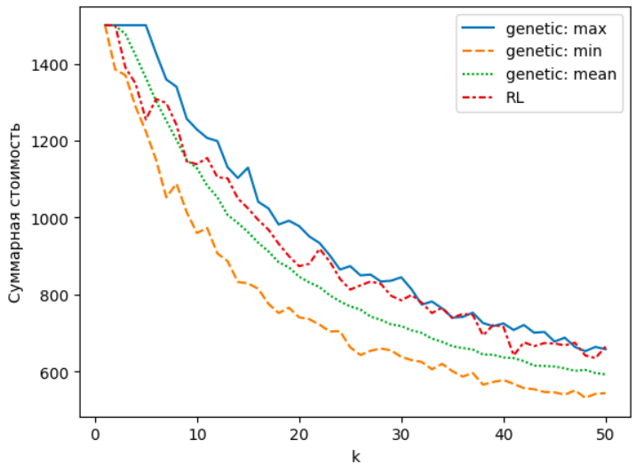

## Введение

В настоящее время программные решения, выполненные и поставляемые как один или компекс плагинов, являются популярными, а их разработка, исследование особенностей построения и способа поставки - актуальные проблемы в области информационных технологий. Отчасти актуальность может быть объяснена тем обстоятельством, что разработка программного решения как комплекса плагинов является альтернативой микросервисной архитектуре. Однако в отличие от микросервисной, плагинная архитектура применима для разработки решений, предназначенных для автономной работы без необходимости сетевого взаимодействия между компонентами вычислительной системы.

Кроме того, в настоящее время существует возможность поставки одной и той же версии ПО в различных комплектациях. Комплектации отличаются друг от друга объемом реализованного в них функционала. Декомпозиция функционала по плагинам позволяет реалзовать вышеописанную возможность, что обеспечивает сокращение объема бесполезного для потребителя функционала и уменьшить стоимость поставки, что, как следствие, приводит к повышению конкурентоспособности программного продукта.

Оценить эффективность декомпозиции без объективной оценки невозможно. В работе [1] приведена формула для ее рассчета, описаны необходимые условия и ограничения ее применения. Однако отсутствует описание ее применения для реального проекта и не продемонстрировано, на сколько ее применение окажется эффективным.

Целью настоящей работы является провека пригодности теоретически описанных механизмов на реальном проекте. Задачами работы являются:

1. определение входных данных;
2. поиск оптимальной декомпозиции функционала по различным количествам плагинов;
3. формулировка вывода о целесообразности применения механизмов декомпозиции в реальных проектах.

## Исходные данные

Для достижения цели и выполнения обозначенных задач использовано программно-инструментальное средство конфигурирования с открытым исходным кодом "meta-configurator" (https://github.com/MetaConfigurator/meta-configurator.git на ревизии 6068f048) [2-5] и был проведен анализ с целью выявления:

1. функциональных требований
2. файлов исхоного кода
3. трассируемости требований на файлы исходного кода
4. зависимостей между файлами исходного кода

Так же по результатам анализа должны были быть сформированы предполагаемые составы комплектаций.

В ходе анализаци было проанализировано:
|  Язык (формат)  | Количество файлов | Количество строк |
|       :-:       |       :-:         |        :-:       |
| TypeScript      |       143         |       19095      |
| JSON            |        12         |       12397      |
| Vuejs Component |        56         |        6656      |
| Text            |        13         |         195      |
| JavaScript      |         4         |          66      |
| Markdown        |         2         |          68      |
| YAML            |         2         |          28      |
| Dockerfile      |         1         |          22      |
| HTML            |         1         |          15      |
| CSS             |         1         |           5      |
| Итого           |       241         |       38547      |

Не все проанализированные файлы содержат исходный код. Кроме того, не все файлы исходного кода заействованы в реализации каких-либо функциональных требований. Анализ показал, что часть файлов содержат отладочные процедуры, являются конфигурационными или в них описаны сценарии сборки проекта. По результатам анализа сформировано:

1. список функциональных требований, которое реализует программно-инструментальное средство: https://github.com/AlexeyShabliy/codebase-overview/blob/main/requirements.csv;
2. список файлов исходного кода, которые реализуют выявленные функциональные требования: https://github.com/AlexeyShabliy/codebase-overview/blob/main/files.csv;
3. трассируемость функциональных требований на файлы исходного кода: https://github.com/AlexeyShabliy/codebase-overview/blob/main/tracer.json;
4. зависимости между файлами исходного кода: https://github.com/AlexeyShabliy/codebase-overview/blob/main/dependencies.json;
5. перечень комплектаций с указанием состава реализуемых в них требований: https://github.com/AlexeyShabliy/codebase-overview/blob/main/complectations.json.

## Методы

В рамках преобразования необходимо было определить исходные данные:

1. $l$ - число комплектаций
2. $m$ - число файлов исходного кода
3. $n$ - число функциональных требований
4. $Q_{n \times m}$ - матрица трассируемости функциональных требований на файлы исходного кода
5. $R_{l \times n}$ - матрица комплектаций
6. $D_{m \times m}$ - матрица зависимостей файлов исходного кода

Числа и матрицы необходимы для рассчета суммарной стоимости поставляемых комплектаций [1] по следующему алгоритму:

1. $F_{l \times m} \gets R \cdot Q$
2. $\displaystyle \hat{F}_{l \times m} \gets F \cdot \sum^{m}_{i = 0}D^{i}$
3. $P_{l \times k} \gets f_{in}(\hat{F} \cdot X)$
4. $\dot{F}_{m \times l} \gets X \cdot P^{T}$
5. $\dot{R}_{n \times l} \gets f_{im}(Q \cdot \dot{F})$
6. $\dot{R}^{T} \cdot C \cdot \dot{R}$

В работе [1] матрицы: 

1. $R$ обозначена как $E$;
2. $Q$ обозначена как $T$; 
3. $X$ обозначена как $A$.

В приведенном алгоритме величины $C$ и $k$ принимают следующие значения:

1. $C_{n \times n}, C \gets E$
2. $k \in [1; 50], k \in \mathbb{Z}$

Преобразование результатов анализа кодовой базы в исходные данные работы алгоритма показло рамеры матриц, с которыми предстоит работать при рассчете значения целевой функции:

1. $l = 10$
2. $m = 124$
3. $n = 161$

В работе [1] приводится решение оптимизационной задачи путем ее сведения к задаче линейного программирования с последующим применением программных решателей. Для оценки количества переменных и ограничений в задаче линейного программирования были использованы следующие формулы:

1. Число переменных: $m \cdot k + l \cdot k + l \cdot m \cdot k + l \cdot n + l \cdot n \cdot (n + 1) / 2$
2. Число ограничений: $m + 2 \cdot l \cdot k + 3 \cdot l \cdot m \cdot k + 2 \cdot l \cdot n + 3 \cdot l \cdot n \cdot (n + 1) / 2$

Используя эти формулы можно оценить размеры задач линейного программирования при различных значениях k:

| $k$ | Число переменных | Число ограничений |
| :-: |         :-:      |        :-:        |
|  1  |       133394     |       398314      |
| 10  |       145760     |       431974      |
| 20  |       159500     |       469374      |
| 30  |       173240     |       506774      |
| 40  |       186980     |       544174      |
| 50  |       200720     |       581574      |

Из приведенного в работе [1] переченя программных решателей использовать по открытым лицензиям для решения задач таких размеров можно только два: GNU Linear Programming Kit (glpk) и COIN-OR Branch-and-Cut (cbc). Кроме того, их применение сопряжено со значительными временными издержками. Для оценки потребного времени проводились его замеры со значениями коэффициента $k \in [1; 10]$ и уменьшенном значении $l = 1, R \gets R_{1}$.

Для проведения вычислений использовалось оборудование со следующими характеристиками:

1. операционная система - Ubuntu 23.04;
2. процессор - 2-ядерный процессор Intel Core i5 с тактовой частотой 1,8GHz;
3. объем ОЗУ - 8 ГБ.

Используемые версии решателей:

1. glpk версии 5.0;
2. cbc версии 2.10.12.

Результаты проведенных экспериментов приведены в таблице:

| $k$ | Число переменных | Число ограничений | glpk (cost) | cbc (cost) | glpk (duration) | cbc (duration) |
| :-: |   :-:   |   :-:   |  :-:  |  :-:  |  :-:  |    :-:  |
|  1  |  13451  |  39943  |  150  |  150  |  1.6  |    3.5  |
|  2  |  13700  |  40317  |  150  |  103  |  4.1  |    6.0  |
|  3  |  13949  |  40691  |  150  |  103  |  7.5  |   71.2  |
|  4  |  14198  |  41065  |  122  |  103  | 10.5  |   63.4  |
|  5  |  14447  |  41439  |  150  |  103  | 11.2  |  173.0  |
|  6  |  14696  |  41813  |  148  |  103  | 16.4  |  118.9  |
|  7  |  14945  |  42187  |  150  |  103  | 27.6  |   80.7  |
|  8  |  15194  |  42561  |  150  |  103  | 47.6  |   69.3  |
|  9  |  15443  |  42935  |  150  |  103  | 46.2  |   80.1  |
| 10  |  15692  |  43309  |  103  |  103  | 34.0  |   72.7  |

Сопоставляя размеры оптимизационных задач, а так же оценки потребного времени был сделан вывод, что применение программных решателей потребует значительного времени для выполнения всех необходимых вычислительных экспериментов. В связи с этим было принято решение об использовании альтернативных способах решения оптимизационной задачи. Было решено в качестве аналогов выбрать один эвристический алгоритм и один метод машинного обучения. В качестве эвристического алгоритма был выбран генетический алгоритм, в качестве метода машинного обучения - reinforcement learning (RL, обучение с подкреплением).

Применяемый генетический алгоритм имеет следующую конфигурацию:

| Параметр конфигурации     | Значение     |
|           :-:             |    :-:       |
|  Число поколений          |    1000      |
|  Число хромосом           |    4         |
|  Число генов              |    $m$       |
|  Тип кроссовера           | single-point |
|  Тип мутации              |    swap      |
|  Процент мутирующих генов |    10        |

Применяемый RL имеет следующую конфигурацию:

| Параметр конфигурации                    | Значение      |
|          :-:                             |       :-:     |
|  Число итераций                          |      1000     |
|  Пространство действий                   | MultiDiscrete |
|  Пространство наблюдения                 |      Box      |
|  Число измерений пространства наблюдения |      $k$      |
|  Алгоритм                                |      A2C      |

Значением функции адаптации является противоположное значение целевой функции. Это верно как при работе генетического алгоритма, так и при применении RL.

Для вычисления значения функции адаптации на каждой итерации должно производиться преобразование матрицы $X$ из генерируемого алгоритмом решения. Рассматривалось два варианта генерируемого решения:

1. $\dot{X}_{1 \times m \cdot k} = ||\dot{x}_{i}||$ - $m \cdot k$ бинарных значений;

2. $\ddot{X}_{1 \times m} = ||\ddot{x}_{i}||$ - $m$ целых значений в диапазоне $[1; k]$.

Преобразование $\dot{X}$ в $X$:

$$x_{i, j} = \dot{x}_{i \cdot (k - 1) + j} \quad i = \overline{1, m} \quad j = \overline{1, k}$$

Преобразование $\ddot{X}$ в $X$:

$$X = Z$$

$$j = \ddot{x}_{i} \quad x_{i, j} = 1 \quad i = \overline{1, m}$$

Анализ вариантов генерируемого решения показал, что преобразование $\ddot{X}$ в $X$ гарантирует выполнения условия $\displaystyle \sum_{i = 1}^{m}X_{i} = 1$ [1], кроме того длина вектора $\ddot{X}$ меньше чем длина $\dot{X}$, что упрощает поиск оптимального решения. Поэтому принято решение генерировать на каждой итерации алгоритма вектор $\ddot{X}$.

| $k$ | genetic (cost) | rl (cost) | genetic (duration) | rl (duration) |
| :-: |     :-:        |     :-:   |        :-:         |     :-:       |
|  1  |     150        |     150   |        1.2         |     52.5      |
|  2  |     150        |     150   |        1.7         |     57.0      |
|  3  |     150        |     150   |        1.7         |     57.0      |
|  4  |     150        |     150   |        1.7         |     56.8      |
|  5  |     150        |     150   |        1.6         |     56.8      |
|  6  |     150        |     150   |        1.8         |     57.2      |
|  7  |     150        |     150   |        1.9         |     57.2      |
|  8  |     150        |     150   |        1.8         |     57.7      |
|  9  |     150        |     142   |        2.0         |     56.8      |
| 10  |     145        |     145   |        1.7         |     56.6      |

Оценка временных затрат показала, что с целью повышения результативности применения генетического алгоритма можно выполнять многократный его запуск с последующим анализом не одного, а многих результатов. Например, можно учитывать маинимальное, максимальное или среднее значение. Для RL это недопустимо, т.к. приведет к значительным временным издержакам проводимых вычислений. 

## Результаты и обсуждение

Для достижения цели настоящего исследования была проведена серия вычислительных экспериментов по решению оптимизационной задачи для различных значений коэффициента $k$. Вычислительные экперименты с применением генетического алгоритма для каждого из значений $k$ провоились по 100 раз с последующим определением максимального, минимального и среднего значений целевой функции. Для RL вычислительный эксперимент для каждого из значений $k$ выполнялся однократно.

На риснуке приводится графическая интерпритация выполненных вычислительных экспериментов.

Результаты экспериментов показывают, что для рассматриваемого проекта ПО применение разработанного в работе [1] механизма актуально. Это подтверждает снижение суммарной стоимости поставляемых комплектаций ПО с ростом числа плагинов, по которым выполняется декомпозиция функционала.

## Заключение

В работе продемонстрирована пригодность применимость теоретических механизмов из работы [1] на примере проекта с открытым исходным кодом, а так же представлено использование генетического алгоритма и RL как альтернативы математической формализации и последующего применения программных решателей.

В дальнейших исследованиях планируется проведение внедрения выполненных наработок и выполнение оценки их успешности в условиях рынка.

## Библиографический список

1. Судаков В.А., Шаблий А.Д. Оптимизация послепродажного обслуживания программного обеспечения в плагинной архитектуре // Препринты ИПМ им. М.В.Келдыша. 2024. No 69. 17 с. https://doi.org/10.20948/prepr-2024-69 https://library.keldysh.ru/preprint.asp?id=2024-69

2. Felix Neubauer, Paul Bredl, Minye Xu, Keyuriben Patel. Design, Implementation, and Evaluation of a Meta Configuration Tool Using a Schema-to-UI Approach // Datenbank-Spektrum. 2024. https://doi.org/10.1007/s13222-024-00472-7. ISSN: 1618-2162. pp. 1-9. 

3. Felix Neubauer, Jürgen Pleiss, Benjamin Uekermann. Data Model Creation with MetaConfigurator // Datenbanksysteme für Business, Technologie und Web (BTW 2025). https://doi.org/10.18420/BTW2025-60. Gesellschaft für Informatik, Bonn. EISSN: 2944-7682. pp. 933-944. Student Track. Bamberg. 3.-7. März 2025

4. Felix Neubauer. Data model creation with MetaConfigurator // Institute for Visualization and Interactive Systems, University of Stuttgart Universitätsstraße 38 D–70569 Stuttgart. https://doi.org/10.18419/opus-15126. pp. 1-83. Masterarbeit

5. Felix Neubauer, Benjamin Uekermann, Jürgen Pleiss. Data Model Creation with MetaConfigurator // Zenodo. 2025. https://doi.org/10.5281/zenodo.14981537
