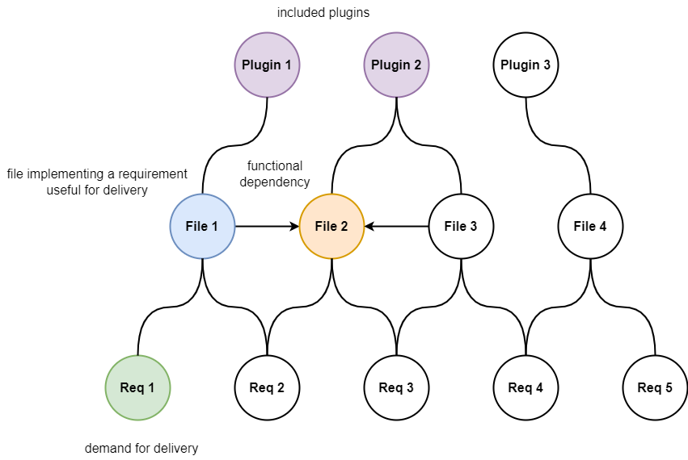

# Система поддержки принятия решений по декомпозиции функционала программного обеспечения между плагинами

## Аннотация
В настоящей статье рассматривается построение и применение математической модели для системы поддержки принятия решений по декомпозиции функционала программного обеспечения между плагинами. Построенная графовая модель применена для решения оптимизационной задачи, исходные данные для которой сформированы по результатам анализа реального проекта с открытым исходным кодом. Выполнено сравнение результатов решения оптимизационной задачи методом обучения с подкреплением и генетическим алгоритмом. Сделан вывод о перспективах дальнейших исследований с целью усложнения целевой функции для реализации возможности оптимизации не объема функционала, а стоимостных издержек программного обеспечения.

### Ключевые слова: программное обеспечение, плагин, декомпозиция, граф, обучение с подкреплением, генетический алгоритм

## Введение

В настоящее время декомпозиция программного обеспечения (ПО) является актуальной проблемой в сфере информационных технологий. Отчасти это может быть объяснено растущей популярностью распределенных систем, которые в последние годы являются флагманским направлением в этой сфере и у которых декомпозиция функционала является фундаментальной задачей.

Микросервисная архитектура является лидирующим решением при построении распределенных систем. И она не стала исключением в вопросе важности декомпозиции функционала. Так, в работах [1], [2] и [3] выполнено описание принципов и шаблонов, руководствуясь которыми следует выполнять декомпозицию функционала между микросервисами.

Как альтернатива им в работе [4] приведен пример использования технологии искусственного интеллекта для кластеризации предметной области с целью дальнейшего разделения кластеров на микросервисы. Эффективность подтверждается объективными оценками двух метрик: связности на уровне сообщений и связности на уровне домена.

Однако выполнять декомпозицию можно не только со стороны сложности предметной области, а и исходя из числа доступных аппаратных мощностей, на которых предстоит выполнять работу будущим микросервисам. В работах [5], [6] и [7] рассматривается именно производительный аспект и сравнивается с показателями решения на монолитной архитектуре. Критериями сравнения является время работы приложений, трудозатраты на развертывание и сопровождение.

В клиент-серверных решениях микросервисная архитектура является лидером в серверной части приложения. В качестве ее аналога в клиентской части можно выделить плагинные системы. Одним из самых популярных решений, задействующим технологию плагинных систем является WordPress [8], который используется миллионами сайтов и имеет почти 55000 доступных плагинов. Однако плагины, выполняя свою работу в единой информационной среде, представленной в виде веб-страницы, могут вступать друг с другом в конфликты и порождать аномалии при работе. Одним из таких примеров является обработка html-тегов. Плагины WordPress дополняют html-сраницу различными тегами, а исполняемый код на javascript не идентифицирует разницу, что тег мог быть добавлен в незаявленном формате, что приводит к конфликтам и аномалиям [9, 10].

Другой пример проблемы - это поставка ПО по различным лицензиям [11, 12]. В зависимости от назначения и возможностей распространения ПО должно включать или не включать компоненты, которые задействуют зависимости с теми или иными ограничениями на распространение.

Обозначенные проблемы могут быть решены благодаря декомпозиции функционала и выполнению поставки не в виде одного плагина, а в виде комплекса. Декомпозиция функционала приводит к возможности поставки ПО в различных комплектациях, целесообразность применения которых устанавливает заказчик. Используя комплектации с ограниченным объемом функционала заказчик может добиться непопадания в свою систему кода, приводящего к аномальной ситуации или к проблемам с лицензиями.

Необходимость выполнения декомпозиции, а так же сложность ее выполнения обосновывают необходимость создания системы поддержки принятия решения (СППР) по декомпозиции функционала ПО между плагинами. Исходными данными для ее работы должны быть:

1. программное обеспечение, которое предстоит декомпозировать;
2. число плагинов, по которым предстоит декомпозировать функционал;
3. формула рассчета объективной оценки выполненной декомпозиции.

В рамках текущего исследования выполненная декомпозиция оценивается по числу реализованных в комплектации функциональных требований ПО: чем ближе эта величина к числу полезных в комплектации требований, тем меньше в комплектации реализовано бесполезных. 

Целью настоящей работы является описание математической модели СППР и демонстрация ее работы при взаимодействии с кодовой базой реального проекта. Работа заключается в разбиении кодовой базы между плагинами в соответствии с заявленными комплектациями полезных функциональных требований.

Задачами работы являются:
1. описание сущностей предметной области и характера их взаимодействия;
2. составление математической модели;
3. анализ реального проекта и рассчет значений исходных данных для работы составленной математической модели;
4. проведение вычислительных экспериментов и оценка работоспособности модели.

## Описание модели

Сущностями предметной области являются:
1. функциональные требования - в них описывается функционал ПО;
2. файлы исходного кода - в них реализованы функциональные требования на языке программирования;
3. плагины - интеграционные единицы ПО в плагинную систему, включенный в поставку плагин.

Для сущностей характерно:
1. требование считается реализованным если в комплектацию включены все реализующие его файлы исходного кода;
2. чтобы файл был включен в комплектацию, в комплектацию должен быть включен плагин, содержащий его;
3. если в комплектацию включен плагин, то он включает в комплектацию все файл, которые содержит.

Сущности вступают в следующие взаимодействия:
1. файлы исходного кода реализуют функциональные требования, при чем один файл может задействован для реализации нескольких требований, а одно требование может быть реализовано в нескольких файлах;
2. файлы исходного кода имеют зависимости друг между другом и для осуществления поставки все зависимости должны быть разрешены;
3. файлы распределены по плагинам, при чем один плагин может включать несколько файлов, а один файл не может быть расположен одновременно в нескольких плагинах.

Таким образом образуется граф, в котором вершины проиндексированы и составляют:

1. $n$ функциональных требований;
2. $m$ файлов исходного кода;
3. $k$ плагинов.

Ребра в графе образуются при:

1. трассировании требований на файлы исходного кода - $n \times m$ связей;
2. наличии зависимостей между файлами - $m \times m$ связей;
3. распределении файлов между плагинами - $m \times k$ связей.

Приведенному описанию соответствует графовая математическая модель, приведенная на рисунке:

Описанная графовая модель, используя информацию об обозначенных вершинах и ребрах, позволяет определять составы плагинов для поставки (алгоритм 1) и реализованных требований (алгоритм 2) в каждой из заявленных $l$ комплектаций.

Для алгоритма 1 исходными данными являются:

1. состав полезных в рамках комплектации требований;
2. трассируемость требований на файлы исходного кода;
3. зависимости между файлами исходного кода;
4. распределение файлов исходного кода по плагинам.

Алгоритм 1:
1. определение файлов исходного кода, релизующих полезные требования;
2. разрешение зависимостей между файлами;
3. определение состава плагинов, которые включают все задействованные файлы.

Пример выполнения алгоритма 1 приведен на рисунке:

Для алгоритма 2 исходными данными являются:
1. состав плагинов в комплектации;
2. распределение файлов исходного кода по плагинам;
3. трассируемость требований на файлы исходного кода.

Алгоритм 2:
1. определение всех файлов, которые содержатся в плагинах;
2. определение требований, для реализации которых поставлены все необходимые файлы исходного кода.

Пример выполнения алгоритма 2 приведен на рисунке:

Вывод: при заданном распределении файлов по плагинам и потребном одном требовании в рамках комплектации реализовано три требования.

Для построения аналитической формулы необходимо вершины и ребра графа описать при помощи математических объектов и ограничений, накладываемых на их значения.

Трассируемость требований на файлы исходного кода удобно описать в виде матрицы $Q_{n \times m} = ||q_{i, j}||$, элементы которой принимают значения в диапазоне $[0; 1]$. В ней номер строки соответствует индексу требования, а номер столбца - индексу файла. Элементы $Q$ принимают значения:
- $>0$ - если $j$-й файл задействован для реализации $i$-го требования;
- $0$ - если $j$-й файл не задействован для реализации $i$-го требования.

Считается, что все требования реализованы, поэтому вводится условие $\sum{Q_{i}} = 1$.

Зависимости между файлами исходного кода удобно описать в виде квадратной матрицы бинарных отношений $D_{m \times m} = ||d_{i, j}||$. В ней номера строк и стролбцов соответствуют индексам файлов. Элементы $D$ принимают значения:
- 1 - если $i$-й файл зависим от $j$-го;
- 0 - если $i$-й файл не зависим от $j$-го.

Считается, что файл не зависит от самого себя, поэтому $d_{i, i} = 0$.

Распределение файлов исходного кода между плагинами удобно описать в виде матрицы бинарных отношений $X_{m \times k} = ||x_{i, j}||$. В ней номер строки соответствует индексу файла, а номер столбца - индексу плагина. Элементы $X$ принимают значения:
- 1 - если $i$-файл относится к $j$-ому плагину;
- 0 - если $i$-файл не относится к $j$-ому плагину.

Считается, что все файлы распределены по плагинам, поэтому вводится условие $\sum{X_{i}} = 1$.

В рамках каждой из $l$ комплектаций полезные требования удобно описать в виде вектора бинарных отношений. Для $l$ комплектаций такие вектора образуют матрицу бинарных отношений $R_{l \times n} = ||r_{i, j}||$. В ней номер строки соответствует номеру комплектации, а номер столбца - индексу тербования. Элементы $R$ принимают значения:
- 1 - если в рамках $i$-й комплектации $j$-требование полезно;
- 0 - если в рамках $i$-й комплектации $j$-требование бесполезно.

Файлы, реализующие полезные требования в каждой из $l$ комплектаций, удобно описать в виде матрицы $F_{l \times n} = ||f_{i, j}||$. В ней номер строки соответствует номеру комплектации, а номер столбца - индексу файла. Значения элементов матрицы $F$:

$$F \gets R \cdot Q$$

Разрешение зависимостей файлов матрицы $F$:

$$F' \gets F \cdot D$$

Разрешение зависимостей файлов матрицы $F'$:

$$F'' \gets F' \cdot D = F \cdot D \cdot D = F \cdot D^{2}$$

Очевидно, что:

$$F^{(s)} \gets F \cdot D^{s}$$

Заметим, что глубина разрешения зависимостей не может превышать значение $m$, а значит общий состав файлов, который требуется включить в поставку:

$$\hat{F} \gets F + \sum_{i = 1}^{m}(F \cdot D^{i}) = F + F \cdot \sum_{i = 1}^{m}D^{i} = F \cdot E + F \cdot \sum_{i = 1}^{m}D^{i} = F \cdot (E + \sum_{i = 1}^{m}D^{i}) = F \cdot (D^{0} + \sum_{i = 1}^{m}D^{i}) = F \cdot \sum_{i = 0}^{m}D^{i}$$

Плагины, которые образуют поставку в каждой из $l$ комплектаций, удобно представить в виде матрицы $P_{l \times m} = ||p_{i, j}||$. В ней номер строки соответствует номеру комплектации, а номер столбца - индексу плагина. Значения элементов матрицы $P$:

$$P \gets f_{in}(F \cdot X)$$

$f_{in}$ - вспомогательная функция, которая применяется для пребразования значений элементов матрицы:

$$f_{in}(x) = \begin{cases}
    1 & \quad \text{если } x > 0 \\
    0 & \quad \text{если } x = 0
\end{cases}$$

Полученные значения матрицы $P$ следует интерпретировать так:

- в рамках $i$-й комплектации $j$-й плагин должен быть поставлен - если $p_{i, j } = 1$;
- в рамках $i$-й комплектации $j$-й плагин не должен быть поставлен - если $p_{i, j } = 0$.

Файлы, которые включены в каждую из $l$ комплектаций, удобно представить в виде матрицы $\dot{F}_{m \times l} = ||\dot{f}_{i, j}||$. В ней номер строки соответствует индексу файла, а номер столбца - номеру комплектации. Значения элементов матрицы $\dot{F}$:

$$\dot{F} \gets X \cdot {P^{T}}$$

Требования, которые реализованы в каждой из $l$ комплектаций, удобно представить в виде матрицы $\dot{R}_{n \times l} = ||\dot{r}_{i, j}||$. В ней номер строки соответствует индексу требования, а номер столбца - номеру комплектации. Значения элементов матрицы $\dot{R}$:

$$\dot{R} \gets f_{im}(Q \cdot \dot{F})$$

$f_{im}$ - вспомогательная функция, которая применяется для пребразования значений элементов матрицы:

$$f_{im}(x) = \begin{cases}
    1 & \quad \text{если } x \ge 1 \\
    0 & \quad \text{если } x < 1
\end{cases}$$

Полученные значения матрицы $\dot{R}$ следует интерпретировать так:

- в рамках $j$-й комплектации $i$-е требование реализовано - если $\dot{r}_{i, j} = 1$;
- в рамках $j$-й комплектации $i$-е требование не реализовано - если $\dot{r}_{i, j} = 0$.

Таким образом может быть составлена и решена оптимизационная задача с целевой функцией минимизации:

$$\min_{X} \sum \sum \Bigg[ f_{im} \Bigg( Q \cdot \bigg( X \cdot \Big[ f_{in} \big( (R \cdot Q \cdot \sum_{i = 0}^{m}D^{i}) \cdot X  \big)  \Big]^{T}  \bigg) \Bigg)  \Bigg]^{T} $$

## Исходные данные для решения оптимизационной задачи

В качестве исходных данных предполгалось задействовать ПО с открытым исходным кодом, которое было бы по своим функциональным возможностям полезным не одной категории пользователей, а так же обеспечивало комплекс функциональных возможностей для целенаправленного разделения его на разные комплектации.

Для проведения экспериментов было выбрано веб-приложение с открытым исходным кодом "meta-configurator" [13, 14, 15, 16]. Оно генерирует графический пользовательский интерфейс в зависимости от схемы, документ в соответствии с которой загрузил пользователь. Благодаря этому достигается значительное сокращение затрат на разработку и поддержку специфичного интерфейса для конкретного формата.

Оно использует подход "схема - пользовательский интерфейс" с тремя ключевыми особенностями:

1. обеспечивает унифицированное представление, сочетающее достоинства как графического интерфейса, так и текстового редактора;
2. обеспечивает наличие редактора схем;
3. поддерживает расширенные функции схем, включая условия и ограничения.

Результаты проведенного разработчиками исследования среди пользователей свидетельствуют об эффективности предложенного ими подхода извлечения информации из данных и схем, а так же их редактирования.

В контексте настоящей работы работа с пользователями, а так же широкий спектр функциональных возможностей ПО обуславливает актуальность применения теоретических результатов исследования на этом практическом примере. Так, например, можно было бы разделять и поставлять независимо работу со схемами в форматах JSON и XML или управление данными и управление схемами.

Был проведен анализ кодовой базы ПО (https://github.com/MetaConfigurator/meta-configurator.git на ревизии 6068f048) с целью выявления:

1. функциональных требований
2. файлов исхоного кода
3. трассируемости требований на файлы исходного кода
4. зависимостей между файлами исходного кода

Так же по результатам анализа должны были быть сформированы предполагаемые составы комплектаций.

Было проанализировано:
|  Язык (формат)  | Количество файлов | Количество строк |
|       :-:       |       :-:         |        :-:       |
| TypeScript      |       143         |       19095      |
| JSON            |        12         |       12397      |
| Vuejs Component |        56         |        6656      |
| Text            |        13         |         195      |
| JavaScript      |         4         |          66      |
| Markdown        |         2         |          68      |
| YAML            |         2         |          28      |
| Dockerfile      |         1         |          22      |
| HTML            |         1         |          15      |
| CSS             |         1         |           5      |
| Итого           |       241         |       38547      |

Не все проанализированные файлы содержат исходный код. Кроме того, не все файлы исходного кода заействованы в реализации каких-либо функциональных требований. Анализ показал, что часть файлов содержат отладочные процедуры, являются конфигурационными или в них описаны сценарии сборки проекта. По результатам анализа сформировано:

1. список функциональных требований, которое реализует программно-инструментальное средство - https://github.com/AlexeyShabliy/codebase-overview/blob/main/requirements.csv;
2. список файлов исходного кода, которые реализуют выявленные функциональные требования - https://github.com/AlexeyShabliy/codebase-overview/blob/main/files.csv;
3. трассируемость функциональных требований на файлы исходного кода - https://github.com/AlexeyShabliy/codebase-overview/blob/main/tracer.json;
4. зависимости между файлами исходного кода - https://github.com/AlexeyShabliy/codebase-overview/blob/main/dependencies.json;
5. перечень комплектаций с указанием состава реализуемых в них требований -  https://github.com/AlexeyShabliy/codebase-overview/blob/main/complectations.json.

Результаты анализа сконвертированы в матрицы $R_{l \times n}, Q_{n \times m}, D_{m \times m}$, имеющие следующие размеры:

1. $l = 10$
2. $m = 124$
3. $n = 161$

## Вычислительные эксперименты
Вычислительные эксперименты проводились с целью подтвердить или опровергнуть гипотезу, что с увеличением числа плагинов количество бесполезного функционала по отношению ко всем возможным комплектациям будет уменьшаться.
Для проведения вычислений использовалось оборудование со следующими характеристиками:

1. операционная система - Ubuntu 23.04;
2. процессор - 2-ядерный процессор Intel Core i5 с тактовой частотой 1,8GHz;
3. объем ОЗУ - 8 ГБ.

Вычислительные эксперименты заключались в поиске оптимальных значений матрицы $X$, которые бы максимизировали значение обратное целевой функции.
Рассматривалось два режима работы алгоритма поиска значений матрицы $X$:

1. $\dot{X}_{1 \times m \cdot k} = ||\dot{x}_{i}||$ - $m \cdot k$ бинарных значений;

2. $\ddot{X}_{1 \times m} = ||\ddot{x}_{i}||$ - $m$ целых значений в диапазоне $[1; k]$.

Преобразование $\dot{X}$ в $X$:

$$x_{i, j} = \dot{x}_{i \cdot (k - 1) + j} \quad i = \overline{1, m} \quad j = \overline{1, k}$$

Преобразование $\ddot{X}$ в $X$:

$$X = Z$$

$$j = \ddot{x}_{i} \quad x_{i, j} = 1 \quad i = \overline{1, m}$$

Анализ вариантов генерируемого алгоритмом решения показал, что преобразование $\ddot{X}$ в $X$ гарантирует выполнения условия $\sum X_{i} = 1$, кроме того длина вектора $\ddot{X}$ меньше чем длина $\dot{X}$, что упрощает поиск оптимального решения. Поэтому было решено генерировать на каждой итерации алгоритма вектор $\ddot{X}$.

Поиск оптимальных значений матрицы $X$ методом полного перебора на задаче размерности представленных исходных данных не представляется возможным. В связи с этим использовались альтернативные способы решения оптимизационной задачи.

Reinforcement Lerning (RL) - обучение с подкреплением, является одним из лидирующих методов на основе технологии искуссвенного интеллекта [17]. Способность RL выполнять непрерывное обучение [18] обуславливает целесообразность его применения для решения сформулированной оптимизационной задачи, а в качестве аналога RL рассматривается применение генетического алгоритма [19].

Применяемый RL имеет следующую конфигурацию:

| Параметр конфигурации                    | Значение      |
|          :-:                             |       :-:     |
|  Число итераций                          |      1000     |
|  Пространство действий                   | MultiDiscrete |
|  Пространство наблюдения                 |      Box      |
|  Число измерений пространства наблюдения |      $k$      |
|  Алгоритм                                |      A2C [20] |

Конфигурация применяемого генетического алгоритма:

| Параметр конфигурации     | Значение     |
|           :-:             |    :-:       |
|  Число поколений          |    1000      |
|  Число хромосом           |    4         |
|  Число генов              |    $m$       |
|  Тип кроссовера           | single-point |
|  Тип мутации              |    swap      |
|  Процент мутирующих генов |    10        |

Было выполнено сравнение их быстродействия на задаче меньшей размерности, в которой $l = 1, R = R_{1}$. Результаты сравнения быстродействия приведены в таблице:

| $k$ | genetic (cost) | rl (cost) | genetic (duration) | rl (duration) |
| :-: |     :-:        |     :-:   |        :-:         |     :-:       |
|  1  |     150        |     150   |        1.2         |     52.5      |
|  2  |     150        |     150   |        1.7         |     57.0      |
|  3  |     150        |     150   |        1.7         |     57.0      |
|  4  |     150        |     150   |        1.7         |     56.8      |
|  5  |     150        |     150   |        1.6         |     56.8      |
|  6  |     150        |     150   |        1.8         |     57.2      |
|  7  |     150        |     150   |        1.9         |     57.2      |
|  8  |     150        |     150   |        1.8         |     57.7      |
|  9  |     150        |     142   |        2.0         |     56.8      |
| 10  |     145        |     145   |        1.7         |     56.6      |

Оценка быстродействия показала, что с целью повышения результативности применения генетического алгоритма можно выполнять многократный его запуск с последующим анализом не одного, а многих результатов. Например, можно учитывать минимальное, максимальное и среднее значения. Для RL это недопустимо, т.к. требует значительных временных затрат на проведение вычислений.

Была проведена серия вычислительных экспериментов по решению оптимизационной задачи для различных значений коэффициента $k$ в диапазоне $[1; 50]$. Вычислительные экперименты с применением генетического алгоритма для каждого из значений $k$ провоились по 100 раз с последующим определением максимального, минимального и среднего значений целевой функции. Для RL вычислительный эксперимент для каждого из значений $k$ выполнялся однократно.

На риснуке приводится графическая интерпритация выполненных вычислительных экспериментов.

Результаты экспериментов показывают, что для рассматриваемого проекта ПО применение разработанного в настоящей работе механизма СППР актуально. Это подтверждает снижение общего числа реализованных требований в поставляемых комплектаций ПО с ростом числа плагинов, по которым выполняется декомпозиция функционала.

## Заключение
С статье предложена математическая модель для СППР. Она опробована на реальном проекте с открытым исходным кодом разными оптимизационными алгоритмами, в том числе с задействованием технологии искусственного интеллекта.
В дальнейших исследованиях предполагается доработать целевую функцию так, чтобы она учитывала не признак реализованности требования, а величину издержек на разработку или сопровождение ПО. Кроме того предполагается выполнение математической формализации оптимизационной задачи с целью применения для ее решения программных решателей, таких как GNU Linear Programming Kit и COIN-OR Branch-and-Cut, а так же последующее сравнение с представленными в настоящей работе способами решения оптимизационной задачи.

## Литература

1. Y. Abgaz, A. McCarren, P. Elger, D. Solan, N. Lapuz, M. Bivol, G. Jackson, M. Yilmaz, J. Buckley, P. Clarke, "Decomposition of Monolith Applications Into Microservices Architectures: A Systematic Review", IEEE TRANSACTIONS ON SOFTWARE ENGINEERING, VOL. 49, NO. 8, AUGUST 2023, https://doi.org/10.1109/TSE.2023.3287297
2. Chaitanya K. Rudrabhatla, "Impacts of Decomposition Techniques on Performance and Latency of Microservices", (IJACSA) International Journal of Advanced Computer Science and Applications, Vol. 11, No. 8, 2020
3. V. Velepucha, P. Flores, "A Survey on Microservices Architecture: Principles, Patterns and Migration Challenges", Received 14 July 2023, accepted 3 August 2023, date of publication 15 August 2023, date of current version 23 August 2023. DOI: 10.1109/ACCESS.2023.3305687
4. O. Al-Debagy, P. Martinek, "A MICROSERVICE DECOMPOSITION METHOD THROUGH USING DISTRIBUTED REPRESENTATION OF SOURCE CODE", Scalable Computing: Practice and Experience, ISSN 1895-1767, http://www.scpe.org © 2021 SCPE. Volume 22, Issues 1, pp. 39–52, DOI 10.12694:/scpe.v22i1.1836
5. M. Hafiz Hasan, M. Hafeez Osman, N. Indriaty Admodisastro, M. Sufri Muhammad, "From Monolith to Microservice: Measuring Architecture Maintainability", (IJACSA) International Journal of Advanced Computer Science and Applications, Vol. 14, No. 5, 2023
6. G. Blinowski, A. Ojdowska, A. Przybylek, "Monolithic vs. Microservice Architecture: A Performance and Scalability Evaluation", Received November 30, 2021, accepted February 16, 2022, date of publication February 18, 2022, date of current version February 28, 2022. DOI 10.1109/ACCESS.2022.3152803
7. D. Faustino, N. Gonçalves, M. Portela, A. Rito Silva, "Stepwise migration of a monolith to a microservice architecture: Performance and migration effort evaluation", Performance Evaluation, Volume 164, May 2024, 102411, https://doi.org/10.1016/j.peva.2024.102411
8. J. Lin, M. Sayagh, A. E. Hassan, "The Co-evolution of theWordPress Platform and Its Plugins", ACM Transactions on Software Engineering and Methodology, Vol. 32, No. 1, Article 19. Pub. date: February 2023
9. I. Lima, J. Cândido, M. d'Amorim, "Practical detection of CMS plugin conflicts in large plugin sets", Information and Software Technology, 118, 1-13. Article 106212. https://doi.org/10.1016/j.infsof.2019.106212
10. H. Viet Nguyen, C. Kästner, T. N. Nguyen, "Exploring variability-aware execution for testing plugin-based web applications", ICSE 2014: Proceedings of the 36th International Conference on Software Engineering, pp. 907 - 918, https://doi.org/10.1145/2568225.2568300
11. N. Wintersgill, T. Stalnaker, L. A. Heymann, O. Chaparro, D. Poshyanyk, "“The Law Doesn’tWork Like a Computer”: Exploring Software Licensing Issues Faced by Legal Practitioners", Proceedings of the ACM on Software Engineering, Volume 1, Issue FSE, Article No.: 40, pp. 882 - 905, https://doi.org/10.1145/3643766
12. W. Xu, H. He, K. Gao, M. Zhou, "Understanding and Remediating Open-Source License Incompatibilities in the PyPI Ecosystem", ASE '23: Proceedings of the 38th IEEE/ACM International Conference on Automated Software Engineering, pp. 178 - 190, https://doi.org/10.1109/ASE56229.2023.00175
13. F. Neubauer, P. Bredl, M. Xu, K. Patel, "Design, Implementation, and Evaluation of a Meta Configuration Tool Using a Schema-to-UI Approach", Datenbank-Spektrum. 2024. https://doi.org/10.1007/s13222-024-00472-7. ISSN: 1618-2162. pp. 1-9. 
14. F. Neubauer, J. Pleiss, B. Uekermann, "Data Model Creation with MetaConfigurator", Datenbanksysteme für Business, Technologie und Web (BTW 2025). https://doi.org/10.18420/BTW2025-60. Gesellschaft für Informatik, Bonn. EISSN: 2944-7682. pp. 933-944. Student Track. Bamberg. 3.-7. März 2025
15. F. Neubauer, "Data model creation with MetaConfigurator", Institute for Visualization and Interactive Systems, University of Stuttgart Universitätsstraße 38 D–70569 Stuttgart. https://doi.org/10.18419/opus-15126. pp. 1-83. Masterarbeit
16. F. Neubauer, B. Uekermann, J. Pleiss, "Data Model Creation with MetaConfigurator", Zenodo. 2025. https://doi.org/10.5281/zenodo.14981537
17. P. Ladosz, L. Weng, M. Kim, H. Oh, "Exploration in deep reinforcement learning: A survey", Information Fusion, Volume 85, September 2022, pp. 1-22, https://doi.org/10.1016/j.inffus.2022.03.003
18. D. Abel, A. Barreto, B. Van Roy, D. Precup, H. Van Hasselt, "A definition of continual reinforcement learning", NIPS '23: Proceedings of the 37th International Conference on Neural Information Processing Systems
Article No.: 2192, pp. 50377 - 50407
19. Y. Song, L. Wei, Q. Yang, J. Wu, L. Xing, Y. Chen, "RL-GA: A Reinforcement Learning-based Genetic Algorithm for Electromagnetic Detection Satellite Scheduling Problem", Swarm and Evolutionary Computation, Volume 77, March 2023, 101236, pp. 1-29, https://doi.org/10.1016/j.swevo.2023.101236
20. S. Huang, A. Kanervisto, A. Raffin, W. Wang, S. Ontañón, R. Fernand Julien Dossa, "A2C is a special case of PPO", arXiv:2205.09123, https://doi.org/10.48550/arXiv.2205.09123
